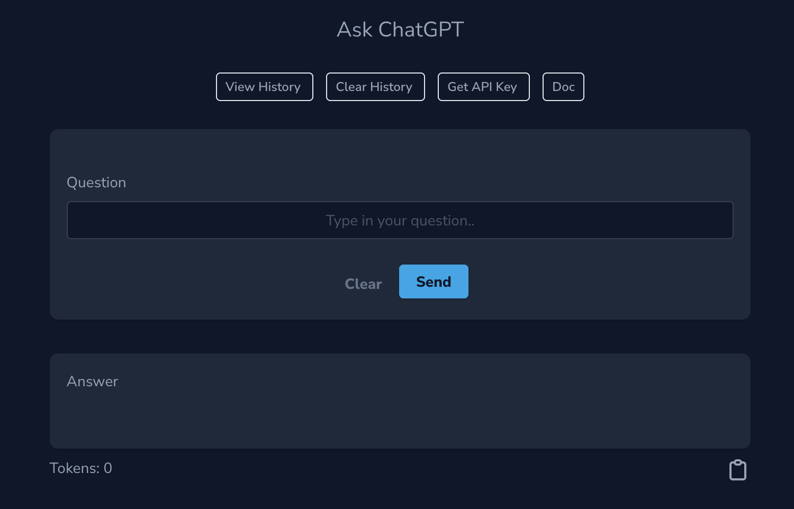
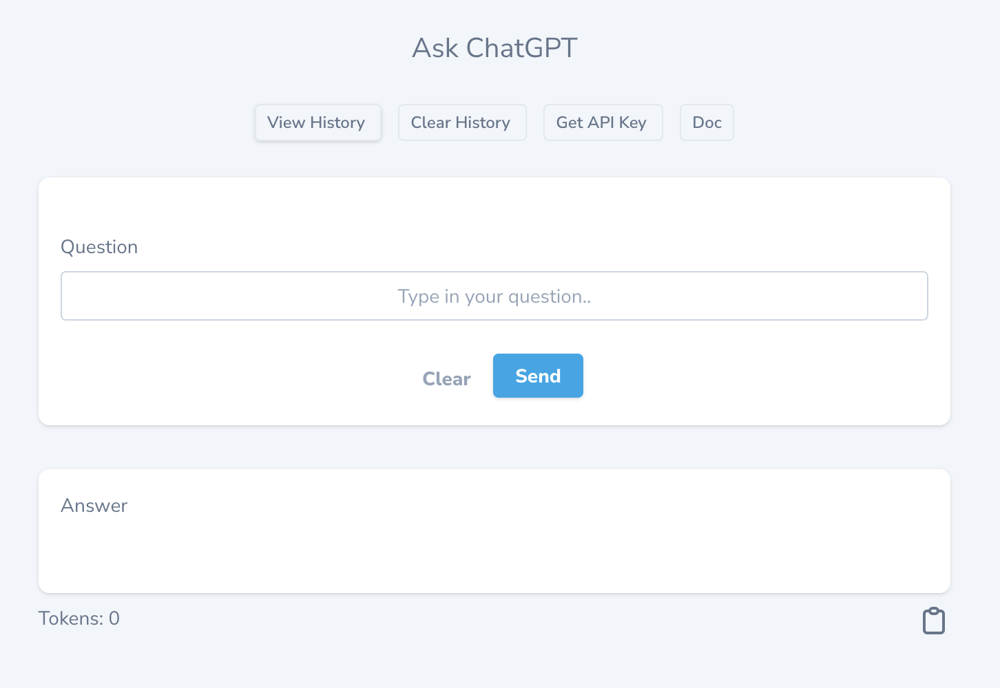
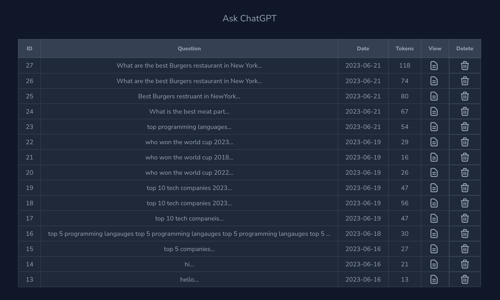
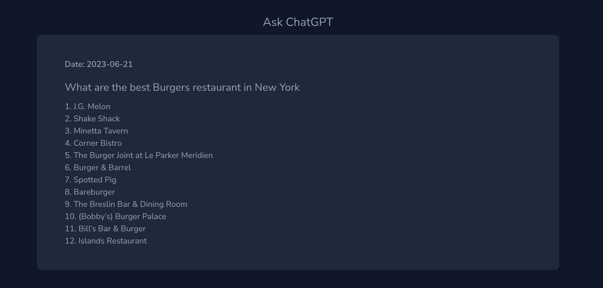

### Laravel Nova 4 ChatGPT Integration Tool

A Laravel Nova 4 ChatGPT Integration Tool combines Laravel Nova 4 with the ChatGPT API. 

## Features
- Ask ChatGPT
- Store questions to database
- Copy answer
- Display total Tokens used for each request
- Tracks token usage
- History Page for easy reference
- View question page
- Delete question
- Clear history

### Requirements
- PHP 8.0 or higher
- Nova 4
- OpenAI API Key
- 
## Installation

You can install the package into a Laravel app that uses Nova via composer:

```bash
composer require naif/chatgpt
```

Publish Model, Migration and Config files

```
php artisan vendor:publish
```

Run Migrate
```
php artisan migrate
```

Select: Naif\Chatgpt\ToolServiceProvider

Add the below to .env file:

```
CHATGPT_NOVA4_API_KEY=###############
CHATGPT_NOVA4_MAX_TOKENS=1000
```

You can increase the tokens to get more text from ChatGPT response.
 
## Usage

Add the tool to NovaServiceProvider.php

```
  public function tools()
    {
        return [
            new Chatgpt()
        ];
    }
```

## Screenshots









## Support:
naif@naif.io

https://naif.io

Bug Tracker:

https://github.com/naifalshaye/chatgpt-nova4/issues

## License

The MIT License (MIT). Please see [License File](LICENSE.md) for more information.
